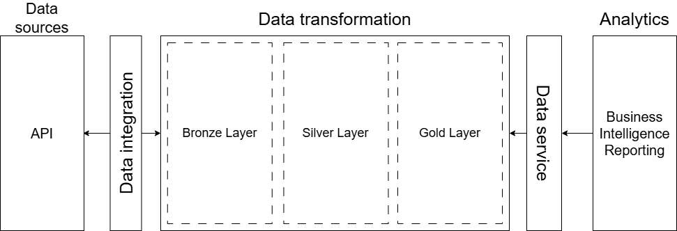
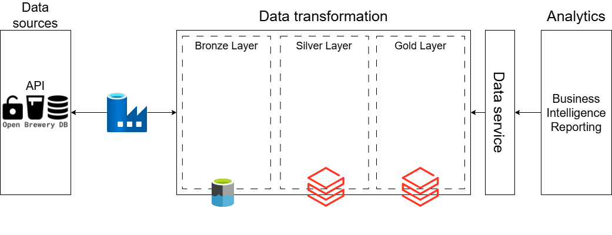

# Case Bees

## Scope
Data Engineer case project for Bees.

## Architecture

An ELT flow was chosen for this project.

### Language
Pyspark was used on this project.

## Extract and Load

### Data Sources
All the data is extracted from Open Brewery DB API and stored raw in .json format.

The extraction is triggered daily 5am UTC.

### Orchestration
Microsoft Azure Data Factory was chosen for orchestration. As said above, the extraction triggers daily 5am UTC.

The main contributor for choosing this solution was time available for the case development. More on this will be discussed later on.

### Storage
To store raw data, the project uses Azure Blob Storage because it provides redundancy and guarantees access over the network in case other tools need to use the data.

As for the silver and gold layers, it was used Databricks File System (dbfs) to store the data as delta as the data was already in the platform. For gold layer, it was also created a table with the data consumed in the day the pipeline ran, being overwriten in every databricks run (everyday if automated).

## Transform
Transformations are executed in Databricks using Databrikcs Jobs and run daily, scheduled to run 7 am UTC.

No significante changes were made in the dataframe. Except column name changes, switching null values with 'Not informed' and removing 2 null columns.

## Cloud Setup
This project was made using Azure cloud.
Resources necessary to run:
- Azure Key Vault
- Azure Data Factory
- Azure Databricks
- Azure Storage Account

1. Setup Azure Storage account and create a folder directory "brz/breweries";
2. Setup Azure Key Vault and add a secret with Storage Account key;
3. Setup Azure Data Factory
    - Create 2 linked services. One to get data from HTTP and one to send data to Azure Storage. Create variables as you see fit;
    - Create 2 datasets, one to use with HTTP and one to send it to Azure Storage. Create variables as you see fit;
    - Create a pipeline that get data from provided URL and sends it to the Storage created in the path "brz/breweries/file_name-YYYY-mm-DD" model. Create variables as you see fit;
    - Schedule it to run everyday at 5 am UTC.
4. Setup Databricks resource
    - Link Databricks to Azure Key Vault;
    - Create notebookts treating the data;
    - Schedule jobs brz_svr and svr_gld to run respective pipelines.

## Challenges and improvements
- Better understanding of the business case;
- Implement data quality;
- Implement error handling;
- Implement data monitoring and alerts;
- Switch Azure Data Factory for Apache Airflow;
- Integrate data storage with company data;
- Check if schedule times are ok;
- Resize Databricks Cluster if needed;
- Check permissions for users.